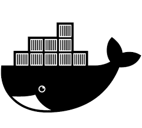

# Rodando um container

Agora que você já tem sua imagem pronta, para criar um container usando a mesma é preciso usar o commando `run`.

## Exemplo
Vamos supor, que você precise de uma aplicação que imprima o texto "Adeus mundo?" no console.
Como é um comportamento bem...complexo... vamos fazer isso usando uma imagem simples, como a do ubuntu, como base para rodar esse comando.

Portanto, o que vamos fazer é:
* usar a imagem de um ubuntu (versão 14.04)
* criar um container que imprima "Adeus mundo?" no console

```bash
$ docker run ubuntu:14.04 echo "Adeus mundo?"
```


## Container interativo

Caso queira um container em que você vai usar-lo de forma interativa, nesse caso, deve-se passar os argumentos `-it` para o `docker run`.

### Exemplo:
Nesse exemplo vamos imprimir "Ola Mundo!" e depois vamos imprimir "Adeus mundo?" no mesmo container.

```bash
$ docker run -it ubuntu:14.04 /bin/bash
```

Ao fazer isso iremos abrir o bash de um novo container, e nesse container poderemos executar então os comandos que quisermos que ele execute:
```bash
$ echo "Ola Mundo!"
$ echo "Adeus mundo?"
```

Para sair (e com isso fechar o container), basta fechar o bash, usando o comando `exit`.


## Mapeando portas

Muitas vezes queremos levantar um container que execute um determinado serviço numa porta, como por exemplo um banco de dados. Uma coisa interessante que podemos fazer com o Docker é mapear alguma porta do Host para apontar pra um porta em um container.

### Exemplo:
Vamos levantar um PostgreSQL num container, sendo que esse serviço roda na porta `5432` dentro do container, e essa mesma porta é exposta pelo container.

Entretanto, queremos poder acessar esse banco de dados, localmente através da porta `6789`.

Isso é, queremos que, ao acessar localmente a porta 6789, que na verdade o que seja acessado seja a porta 5432 do container.


```bash
$ docker run -p 6789:5432 -d postgres:9.3
```


### Começando a ficar confuso...
Você pode ter notado que esse comando run está começando a ficar um tanto grande certo?
Isso é por que estamos rodando um comando bem simples, imagina um comando, mais complexo, que é o que normalmente utilizamos na realidade?
Exemplo:

```bash
$ docker run -p 6789:5432 -e POSTGRES_USER=pg_user -e POSTGRES_PASSWORD=pg_senha postgres:9.3
```

Existem casos piores:

```bash
$ docker run --name some-wordpress -e WORDPRESS_DB_HOST=10.1.2.3:3306 \
    -e WORDPRESS_DB_USER=... -e WORDPRESS_DB_PASSWORD=... -d wordpress
```

Ou ainda piores:
```bash
$ docker run \
         -e SETTINGS_FLAVOR=s3 \
         -e AWS_BUCKET=acme-docker \
         -e STORAGE_PATH=/registry \
         -e AWS_KEY=AKIAHSHB43HS3J92MXZ \
         -e AWS_SECRET=xdDowwlK7TJajV1Y7EoOZrmuPEJlHYcNP2k4j49T \
         -e SEARCH_BACKEND=sqlalchemy \
         -p 5000:5000 \
         registry
```

[Docker-compose, pra que serve?](sobre_docker_compose.md)